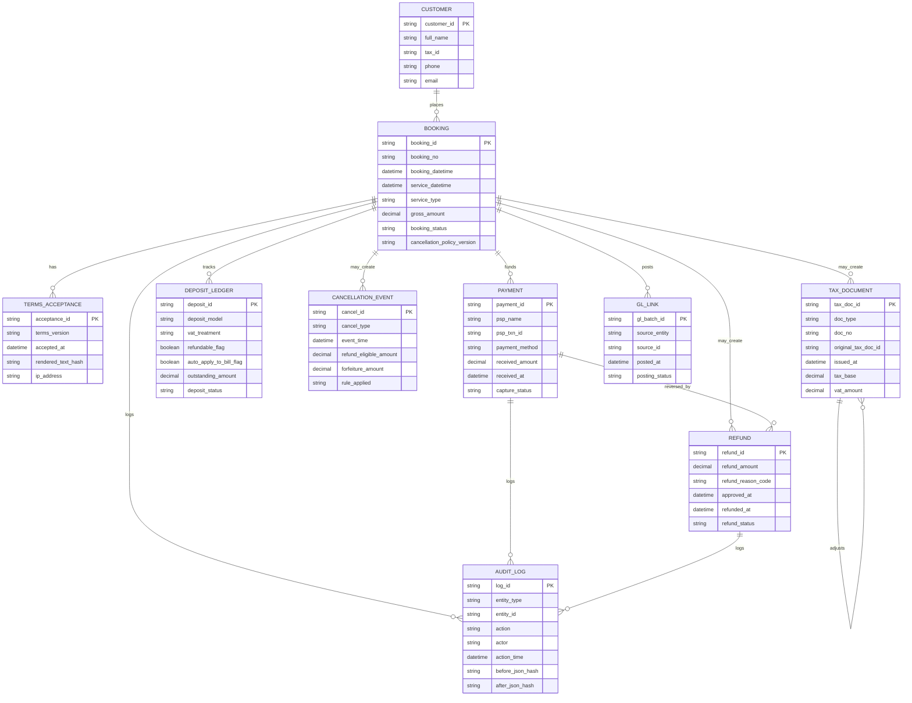
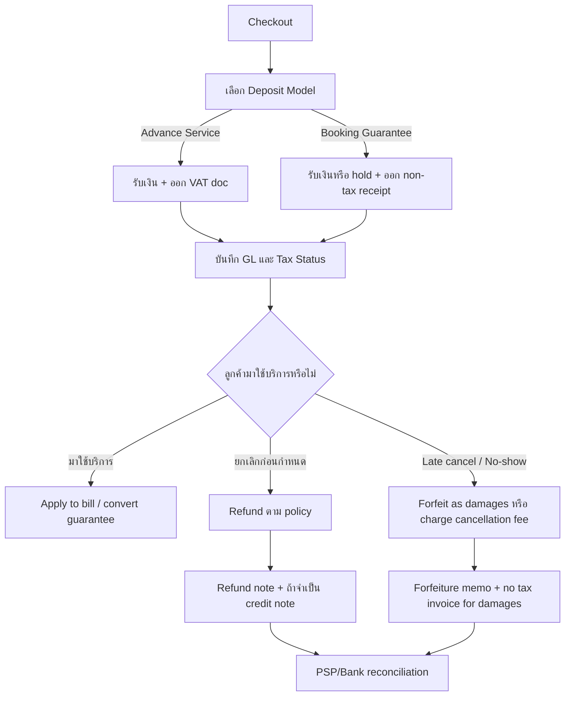
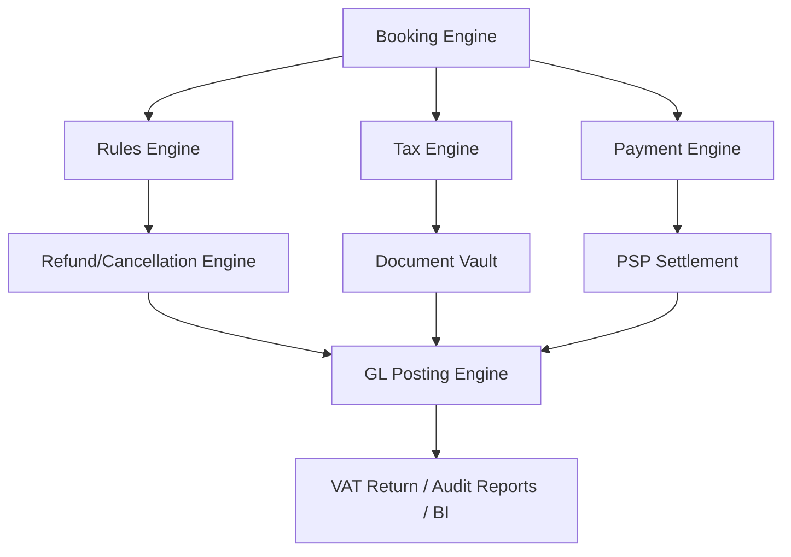

<!--
Provenance: external deep-research synthesis via ChatGPT, 2026-07-22.
Report 1 of 3 in the 2026-07-22 research trilogy (2 = p73-movable-rental-vat-review, 3 = launch-tax-answers).
Status: PENDING PROFESSIONAL CONFIRMATION — decision-support only.
Not legal, tax, or accounting advice; cited RD rulings/orders must be
verified by the engaged accountant/tax counsel before any production
tax behavior is built on this document. Referenced by decisions.md
2026-07-22 entry (booking-guarantee Model B) and docs/BACKLOG.md
accountant launch-blocker.
-->

# การออกแบบ ERP สำหรับเงินจองออนไลน์ที่ริบเมื่อ No-show หรือยกเลิกล่าช้าในบริบทกฎหมายไทย ภาษี บัญชี และอีคอมเมิร์ซ

## บทสรุปผู้บริหาร

ประเด็นสำคัญที่สุดของเรื่องนี้ในกฎหมายไทยคือ **“เงินที่ลูกค้าจ่ายตอนจอง” ต้องถูกจัดประเภทให้ชัดตั้งแต่ต้น** เพราะผลทาง VAT, เอกสารภาษี, และการบันทึกบัญชีเปลี่ยนไปอย่างมีนัยสำคัญตาม “สาระของรายการ” ไม่ใช่ตามชื่อเรียกอย่างเดียว กรมสรรพากรมีแนวทางที่ต้องอ่านประกอบกันสองชุด: ชุดแรก ระบุว่าเงินจ่ายล่วงหน้า เงินประกัน เงินมัดจำ หรือเงินจองที่เรียกเก็บเพื่อการขายสินค้าหรือให้บริการ ต้องนำมารวมเป็นฐานภาษี และสำหรับ “การให้บริการ” จุดความรับผิด VAT เกิดเมื่อได้รับชำระเงิน ส่วนชุดที่สอง ระบุว่า “ค่าเสียหาย/ค่าปรับ/เงินชดเชย” ที่ไม่ใช่ค่าตอบแทนจากการขายสินค้าหรือให้บริการ **ไม่อยู่ในบังคับ VAT** และไม่ต้องออกใบกำกับภาษีสำหรับจำนวนดังกล่าว citeturn33view0turn20view0turn20view1turn45view0turn31view0turn31view1turn31view2turn46view1

ดังนั้น คำตอบของคำถามหลักว่า **“เงินจองที่ริบเมื่อ no-show ต้องเสีย VAT หรือไม่”** คือ **“ขึ้นกับการออกแบบสัญญาและเอกสารตั้งแต่ต้น”** ถ้าธุรกิจออกแบบเงินจองเป็น **เงินรับล่วงหน้าสำหรับบริการ** หรือเป็นจำนวนที่ “นำไปหักค่าบริการแน่นอน” VAT จะเกิดเมื่อรับเงิน และต้องออกใบกำกับภาษีทันทีตามจุดความรับผิดภาษีของบริการ แต่ถ้าออกแบบเป็น **เงินค้ำประกันการจอง** หรือ **วงเงินค้ำประกันผ่านการกันวงเงินบัตร** และในกรณีผิดนัด/ยกเลิกล่าช้า ธุรกิจเรียกเก็บเป็น **ค่าเสียหาย/ค่าปรับ/ค่า Cancellation fee** โดยชัดเจน แนวทางของกรมสรรพากรสนับสนุนว่าจำนวนดังกล่าวอยู่นอก VAT ได้ดีกว่า citeturn45view0turn33view0turn46view0turn46view1turn47view0

ในเชิง ERP จึงควรออกแบบอย่างน้อย **สองโมเดลธุรกิจ** ตั้งแต่ Phase 1 ไม่ใช่พยายามใช้โมเดลเดียวครอบทุกกรณี ได้แก่  
**โมเดล A** “เงินรับล่วงหน้าที่ต้องเสีย VAT” สำหรับกรณีที่กิจการต้องการหักกับค่าบริการแน่นอน และ  
**โมเดล B** “เงินค้ำประกัน/authorization hold + ค่าปรับหรือค่าเสียหายเมื่อผิดนัด” สำหรับกรณีที่กิจการต้องการลดความเสี่ยงการตีความว่าเป็น prepayment ของบริการตั้งแต่วันรับเงิน citeturn33view0turn45view0turn47view0

ในทางบัญชีภายใต้ TFRS 15 เงินที่รับมาก่อนปฏิบัติตามสัญญาโดยทั่วไปเริ่มต้นเป็น **หนี้สินตามสัญญา** หรือภาระผูกพันที่จะคืนเงิน/ให้บริการในอนาคต และเมื่อสิทธิของลูกค้าไม่ถูกใช้จนหมดอายุ มาตรฐานพูดถึงแนวคิด **breakage** ว่ากิจการรับรู้รายได้ได้เมื่อมีการใช้สิทธิหรือเมื่อสิทธิหมดอายุ หรือรับรู้ตามสัดส่วนหากคาดการณ์ breakage ได้อย่างสมเหตุสมผล ขณะเดียวกัน ค่าธรรมเนียมแรกเข้าที่เรียกคืนไม่ได้ก็ไม่ได้ทำให้เกิดรายได้ทันทีเสมอไป หากโดยเนื้อแท้เป็นเพียงเงินจ่ายล่วงหน้าสำหรับสินค้าหรือบริการในอนาคต ต้องเลื่อนไปรับรู้เมื่อมีการโอนสินค้าหรือบริการนั้น citeturn13view0turn13view4

สำหรับคำถามเชิงปฏิบัติของคุณใน Phase 1 คำตอบคือ **การอ้างอิงแค่เลข order/booking อย่างเดียว “ไม่พอ” สำหรับงานบัญชีและ audit trail ที่ดี** แม้กฎหมายธุรกรรมทางอิเล็กทรอนิกส์จะรับรองผลทางกฎหมายของ data message และยอมรับเอกสารอิเล็กทรอนิกส์เป็นหลักฐานได้ แต่กฎหมายก็เน้นเรื่อง **ความครบถ้วน ความไม่ถูกแก้ไข ความสามารถในการแสดงย้อนหลัง แหล่งที่มา ปลายทาง วันเวลา** ของข้อมูลด้วย และหากมีการออกใบลดหนี้ภาษีมูลค่าเพิ่ม ต้องอ้างเลขที่ใบกำกับภาษีเดิมตามประมวลรัษฎากรอย่างชัดเจน citeturn37view0turn18view2

ข้อเสนอแนะเชิงออกแบบจึงคือ:  
ถ้า Phase 1 ยังเชื่อมเอกสารภาษีไม่ครบ ให้ใช้ **internal refund note / refund authorization** ที่มีข้อมูลเชิงควบคุมมากกว่าเลข booking เพียงตัวเดียว และอย่าปล่อยให้กรณีที่ VAT เกิดแล้วต้องรอจน Phase 2 จึงค่อยออกเอกสารภาษี เพราะจะสร้าง risk ทั้งเรื่อง VAT return, การกระทบยอด และ audit exception ได้ทันที citeturn18view2turn45view0turn37view0

## กรอบกฎหมายไทยและคำตอบเรื่อง VAT

### กฎหมายและแนวทางทางการที่เกี่ยวข้อง

กฎหมายและแนวทางที่เกี่ยวข้องกับเงินจองออนไลน์ที่ริบเมื่อ no-show/late cancellation มีอย่างน้อยห้ากลุ่มหลัก

กลุ่มแรกคือ **ประมวลรัษฎากร** ว่าด้วย VAT โดยแกนหลักอยู่ที่มาตรา 77/2 ซึ่งกำหนดว่าการขายสินค้าหรือให้บริการในประเทศไทยอยู่ใน VAT, มาตรา 78/1 ที่กำหนดจุดความรับผิดภาษีสำหรับ “การให้บริการ” ว่าโดยทั่วไปเกิดเมื่อได้รับชำระค่าบริการ เว้นแต่มีการออกใบกำกับภาษีก่อนหรือมีการใช้บริการก่อน, และมาตรา 79 ที่กำหนดให้ฐานภาษีเป็นมูลค่าทั้งหมดที่ได้รับหรือพึงได้รับจากการขายสินค้าหรือให้บริการ ส่วนมาตรา 82/10 และ 86/10 วางระบบ “ใบลดหนี้” เมื่อมูลค่าบริการลดลงหรือมีการเลิกสัญญาบริการตามเหตุและเงื่อนไขที่กำหนดไว้ citeturn19view0turn20view0turn20view1turn23view0turn18view2

กลุ่มที่สองคือ **คำสั่งกรมสรรพากรที่ ป.73/2541** ซึ่งเป็นคำสั่งสำคัญมากสำหรับเรื่อง “เงินจ่ายล่วงหน้า เงินประกัน เงินมัดจำ หรือเงินจอง” คำสั่งนี้ระบุชัดว่าในการให้บริการทั่วไป ผู้ให้บริการต้องนำมูลค่าทั้งหมดที่ได้รับหรือพึงได้รับ ไม่ว่าจะเรียกในชื่อเงินจ่ายล่วงหน้า เงินประกัน เงินมัดจำ เงินจอง หรือชื่อทำนองเดียวกัน มารวมเป็นฐานภาษี VAT และถือว่าความรับผิดในการเสีย VAT เกิดขึ้นเมื่อได้รับชำระเงินดังกล่าว รวมทั้งหากภายหลังมีการคืนเงินตามสัญญา ให้ใช้ใบลดหนี้ตามมาตรา 86/10 citeturn33view0

กลุ่มที่สามคือ **แนววินิจฉัยและคู่มือของกรมสรรพากรเรื่องค่าเสียหาย/ค่าปรับ/เงินชดเชย** ซึ่งวินิจฉัยสอดคล้องกันว่า หากจำนวนเงินที่ได้รับ **ไม่ใช่ค่าตอบแทนจากการขายสินค้าหรือให้บริการ** แต่เป็น “ค่าเสียหาย” หรือ “ค่าปรับตามสัญญา” จำนวนดังกล่าวไม่อยู่ในบังคับ VAT และไม่มีสิทธิ/หน้าที่ออกใบกำกับภาษีสำหรับจำนวนดังกล่าว ตัวอย่างแนววินิจฉัยมีทั้งกรณีเงินชดเชยค่าเสียหายจากการยกเลิกงานสรรหา, ค่าปรับตามสัญญาเหมือง, และกรณีค่าเสียหายจากการยกเลิกการเดินทางในคู่มือภาษีอากรผู้ประกอบการนำเที่ยวของกรมสรรพากรเอง citeturn31view0turn31view1turn31view2turn46view0turn46view1

กลุ่มที่สี่คือ **ประมวลกฎหมายแพ่งและพาณิชย์** โดยมาตรา 377–378 กำหนดลักษณะของ “มัดจำ” ว่าเป็นทั้งพยานหลักฐานของการทำสัญญาและประกันการปฏิบัติตามสัญญา และหากฝ่ายที่วางมัดจำเป็นฝ่ายผิดนัด มัดจำอาจถูกริบได้ ส่วนมาตรา 379 เปิดทางให้กำหนด “เบี้ยปรับ” สำหรับกรณีผิดนัดหรือชำระหนี้ไม่ถูกต้องได้ หลักแพ่งนี้สำคัญมากเพราะเป็นฐานให้กิจการออกแบบ clause ว่า retained amount เป็น “มัดจำที่ริบ” หรือ “เบี้ยปรับ/ค่าเสียหาย” แต่ผลทาง VAT ยังต้องไปอ่านร่วมกับประมวลรัษฎากรและแนววินิจฉัยสรรพากร citeturn42view0

กลุ่มที่ห้าคือ **กฎหมายผู้บริโภคและอีคอมเมิร์ซ** โดย OCPB สรุปว่าธุรกรรมอีคอมเมิร์ซเกี่ยวข้องกับพระราชบัญญัติขายตรงและตลาดแบบตรง, พระราชบัญญัติคุ้มครองผู้บริโภค, พระราชบัญญัติทะเบียนพาณิชย์, พระราชบัญญัติว่าด้วยธุรกรรมทางอิเล็กทรอนิกส์ และประกาศเรื่องการแสดงราคาและรายละเอียดบนระบบออนไลน์ นอกจากนี้ OCPB ยังอธิบายด้วยว่า e-commerce บางประเภทถูกกฎกระทรวงปี 2561 กำหนดว่า “ไม่ถือว่าเป็นตลาดแบบตรง” ซึ่งมีผลต่อการใช้สิทธิบอกเลิกสัญญาตามกฎหมายขายตรง/ตลาดแบบตรง ส่วนกรณีที่ธุรกรรมเข้าข่ายเป็นตลาดแบบตรงจริง OCPB ระบุว่าผู้ประกอบธุรกิจต้องคืนเงินเต็มจำนวนภายใน 15 วันหลังได้รับหนังสือบอกเลิกสัญญา citeturn40view1turn40view2turn40view0

อัตรา VAT ในประเทศไทยยังคงใช้ **7%** ตามพระราชกฤษฎีกาลดอัตราภาษีมูลค่าเพิ่มที่กรมสรรพากรเผยแพร่ ซึ่งขยายเวลาถึงวันที่ 30 กันยายน 2569 citeturn17search1turn17search4

### คำตอบเฉพาะเรื่อง VAT ของเงินจองที่ริบ

คำตอบในทางปฏิบัติคือ **มีสองเส้นทาง และคุณต้องเลือกให้ชัด**

| โมเดลข้อเท็จจริง | ผล VAT | จุดเกิด VAT | เอกสารหลัก |
|---|---|---|---|
| รับเงินจอง/มัดจำ/เงินรับล่วงหน้า “เป็นค่าบริการล่วงหน้า” หรือจะนำไปหักค่าบริการแน่ | ต้องเสีย VAT | เมื่อรับเงินสำหรับบริการ | ใบกำกับภาษี/ใบเสร็จทันที |
| รับ “เงินค้ำประกันการจอง” หรือกันวงเงินบัตรไว้ก่อน และเมื่อ no-show/late cancel จึงเรียก “ค่าเสียหาย/ค่าปรับ/ค่าธรรมเนียมยกเลิก” | แนวสรรพากรสนับสนุนว่าอยู่นอก VAT ถ้าไม่ใช่ค่าตอบแทนจากการให้บริการ | ไม่มี VAT tax point จากค่าชดเชยนั้นเอง | ออกเอกสารรับเงินทั่วไป/เอกสารภายใน ไม่ใช่ใบกำกับภาษีสำหรับส่วนค่าเสียหาย |

ตารางนี้สังเคราะห์จาก ป.73/2541, มาตรา 78/1 และ 79 ของประมวลรัษฎากร, รวมทั้งแนววินิจฉัยและคู่มือของกรมสรรพากรที่ระบุว่าค่าเสียหายจากการยกเลิกการเดินทางไม่อยู่ในบังคับ VAT และไม่มีหน้าที่ออกใบกำกับภาษีสำหรับค่าเสียหายดังกล่าว citeturn33view0turn20view0turn20view1turn46view0turn46view1

คำตอบแบบตรงไปตรงมาสำหรับข้อ (a) คือ:

> **ถ้าธุรกิจรับเงินนั้นเป็น “เงินรับล่วงหน้าค่าบริการ” ตั้งแต่ต้น VAT ต้องเกิดเมื่อรับเงิน และการที่ลูกค้า no-show ภายหลังไม่ได้ลบ VAT ที่เกิดไปแล้วโดยอัตโนมัติ** เว้นแต่มีเหตุให้ลดฐานภาษีและออกใบลดหนี้ตามกฎหมาย  
> **แต่ถ้าจำนวนเงินที่กิจการเก็บไว้เมื่อเกิด no-show เป็น “ค่าเสียหาย/ค่าปรับ/เงินชดเชย” ที่ไม่ใช่ค่าตอบแทนการให้บริการ แนววินิจฉัยของกรมสรรพากรสนับสนุนว่าไม่อยู่ในบังคับ VAT** citeturn45view0turn23view0turn18view2turn31view0turn31view1turn31view2turn46view1

จุดที่ต้องระวังมากคือ **อย่าพยายาม “แปลงสถานะย้อนหลัง”** จากเงินรับล่วงหน้าที่ออกใบกำกับภาษีแล้ว ไปเป็นค่าเสียหายที่ไม่เสีย VAT ภายหลังโดยไม่มีโครงสร้างเอกสารรองรับ เพราะ ป.73/2541 กว้างมากและใช้ถ้อยคำครอบคลุม “เงินประกัน เงินมัดจำ เงินจอง” สำหรับการให้บริการทั่วไปอย่างชัดเจน หากคุณอยากได้ผลลัพธ์ non-VAT ที่แน่นกว่า ควรออกแบบ flow ตั้งแต่ต้นให้ใช้ authorization hold/card guarantee หรือใช้ “ค่าค้ำประกันการจอง” ที่ไม่ถูกนำไปใช้หักค่าบริการอัตโนมัติ และเมื่อเกิดการผิดนัดจึงค่อย convert เป็น “ค่าเสียหาย/ค่าปรับ” แยกต่างหาก citeturn33view0turn47view0turn46view1

### ภาพรวมการตัดสินใจด้าน VAT

```mermaid
flowchart TD
    A[เริ่มรับเงิน/กันวงเงินตอนจอง] --> B{ได้รับ "เงิน" จริงหรือเป็นแค่ Authorization Hold}
    B -->|Authorization Hold เท่านั้น| C[ยังไม่มีเงินรับจริง]
    C --> D{No-show / Late Cancel?}
    D -->|ใช่| E[เรียกเก็บ Cancellation Fee / ค่าเสียหาย]
    D -->|ไม่ใช่| F[ปล่อย hold หรือเรียกเก็บค่าบริการเมื่อมาใช้บริการ]
    B -->|รับเงินจริง| G{เอกสาร/สัญญาระบุว่าเป็นค่าบริการล่วงหน้าหรือไม่}
    G -->|ใช่| H[VAT เกิดเมื่อรับเงิน และออกใบกำกับภาษี]
    G -->|ไม่ใช่ ชี้ว่าเป็นค้ำประกัน| I{ภายหลังเกิดการคืนเงินเต็มจำนวนหรือไม่}
    I -->|คืนเต็ม| J[คืนเงิน และถ้าเคยออก VAT เอกสาร ให้ใบลดหนี้]
    I -->|ไม่คืน เพราะผิดนัด| K[พิจารณาเป็นค่าเสียหาย/ค่าปรับนอก VAT หากข้อเท็จจริงรองรับ]
```

ผังนี้เป็นการสังเคราะห์เชิงออกแบบจากกฎหมายและแนวทางข้างต้น ไม่ใช่ข้อความกฎหมายโดยตรง แต่สอดคล้องกับ logic ของมาตรา 78/1, 79, 82/10, 86/10, ป.73/2541 และแนววินิจฉัยเรื่องค่าเสียหาย/ค่าปรับ citeturn20view0turn20view1turn23view0turn18view2turn33view0turn46view1

## แนวปฏิบัติบัญชีตาม TFRS และตัวอย่างสมุดรายวัน

### หลักการรับรู้รายการ

ภายใต้ TFRS 15 เงินที่ลูกค้าจ่ายมาก่อนที่กิจการจะโอนสินค้าหรือบริการในอนาคตให้ลูกค้า โดยหลักต้องเริ่มที่ **หนี้สินตามสัญญา** หรือภาระผูกพันของกิจการก่อน เมื่อกิจการโอนสินค้าหรือบริการหรือภาระที่ต้องปฏิบัติเสร็จสิ้น จึงค่อยตัดหนี้สินนั้นและรับรู้เป็นรายได้ มาตรฐานยังพูดชัดถึงกรณี **สิทธิที่ลูกค้าไม่ใช้** หรือ breakage ว่าเงินรับล่วงหน้าที่ไม่คืนได้อาจสะท้อนสิทธิของลูกค้าที่จะได้รับสินค้าหรือบริการในอนาคต แต่ลูกค้าอาจไม่ใช้สิทธิทั้งหมด และกิจการต้องรับรู้ส่วนที่คาดว่าจะสละสิทธิเป็นรายได้ตามแบบแผนการใช้สิทธิ หรือเมื่อความเป็นไปได้ที่ลูกค้าจะใช้สิทธิที่เหลือลดลงอย่างมาก citeturn13view0

อีกด้านหนึ่ง TFRS 15 ระบุว่า **ค่าธรรมเนียมแรกเข้าที่เรียกคืนไม่ได้** ก็ไม่ได้แปลว่ากิจการรับรู้เป็นรายได้ทันทีเสมอไป หากค่าธรรมเนียมนั้นโดยเนื้อแท้เป็น “เงินจ่ายล่วงหน้าสำหรับสินค้าหรือบริการที่จะโอนในอนาคต” กิจการต้องรับรู้รายได้เมื่อมีการโอนสินค้าหรือบริการในอนาคต ไม่ใช่ ณ วันที่เรียกเก็บเงิน โดยมาตรฐานยกตัวอย่างค่าสมาชิก ค่าแรกเข้า และค่าติดตั้งต่าง ๆ ไว้อย่างชัดเจน citeturn13view4

สำหรับกรณี no-show/late cancellation สิ่งที่ควรแยกออกจากกันคือ **(ก) timing ของการรับรู้รายได้ทางบัญชี** กับ **(ข) VAT** เพราะสองระบบนี้ไม่จำเป็นต้องได้ผลเหมือนกันเสมอไป ในเชิงบัญชี หากกิจการเก็บเงินไว้ได้ตามสัญญาเมื่อสิทธิของลูกค้าหมดลง กิจการมักสิ้นสุดภาระที่จะคืนเงิน จึงต้องรับรู้ผลประโยชน์ทางเศรษฐกิจเป็นรายได้หรือรายได้อื่นตาม substance ของรายการ แต่ในเชิงภาษีมูลค่าเพิ่ม การจะอยู่ใน VAT หรือไม่ ยังต้องถามต่อว่า retained amount เป็นค่าตอบแทนของ goods/services หรือเป็น damages/penalty ตามแนวสรรพากร citeturn13view0turn13view4turn46view1

### ทางเลือกการนำเสนอในงบการเงิน

ในเชิง presentational policy กิจการไทยมักใช้แนวคิดดังนี้

- ถ้าเงินจองเป็น **advance consideration ของบริการ** และ no-show เป็นเพียงกรณีที่ลูกค้าไม่ใช้สิทธิรับบริการในภายหลัง การรับรู้เป็น **รายได้จากสัญญากับลูกค้า** เมื่อสิทธิหมดอายุสอดคล้องกับแนวคิด breakage ของ TFRS 15 มากกว่า  
- ถ้าข้อเท็จจริงชี้ว่า retained amount เป็น **ค่าเสียหายหรือค่าปรับจากการผิดนัด** ไม่ใช่ค่าตอบแทนการให้บริการ การนำเสนอเป็น **รายได้อื่น / รายได้จากค่าปรับหรือค่าเสียหาย** มักสะท้อน substance ได้ดีกว่า

ข้อสรุปนี้เป็น **การสังเคราะห์เชิงวิชาชีพ** จากหลักใน TFRS 15 ไม่ใช่ถ้อยคำตายตัวของมาตรฐานเกี่ยวกับชื่อบัญชี จึงควรทำ policy paper ภายในองค์กรไว้ชัดเจน โดยเฉพาะถ้าธุรกิจมีทั้งสองโมเดลคู่กัน citeturn13view0turn13view4

### ตารางตัวอย่างสมุดรายวัน

สมมติอัตรา VAT 7% และใช้ตัวอย่างดังนี้  
- **โมเดล A** รับเงินจองเป็นเงินรับล่วงหน้าค่าบริการ 1,070 บาท ซึ่งรวม VAT 70 บาท  
- **โมเดล B** รับเงินค้ำประกันการจอง 1,000 บาท ไม่มี VAT ตอนรับเงิน

| เหตุการณ์ | เดบิต | เครดิต | หมายเหตุ |
|---|---|---|---|
| รับเงินจองแบบ taxable advance | เงินสด/ธนาคาร 1,070 | หนี้สินตามสัญญา 1,000 / ภาษีขาย 70 | ใช้เมื่อเงินเป็นค่าบริการล่วงหน้า |
| ให้บริการเสร็จและนำเงินจองไปหักค่าบริการ | หนี้สินตามสัญญา 1,000 | รายได้ค่าบริการ 1,000 | VAT เกิดไปแล้วตอนรับเงิน |
| ลูกค้ายกเลิกและคืนเงินเต็มจำนวน | หนี้สินตามสัญญา 1,000 / ภาษีขาย 70 | เงินสด/ธนาคาร 1,070 | ต้องออกใบลดหนี้ถ้ามี VAT document เดิม |
| รับเงินค้ำประกันการจองแบบ non-VAT | เงินสด/ธนาคาร 1,000 | หนี้สินเงินค้ำประกันการจอง 1,000 | ใช้เมื่อเงินยังไม่เป็นค่าบริการ |
| ลูกค้ามาใช้บริการ แล้วตกลงแปลงเงินค้ำประกันเป็นค่าบริการล่วงหน้า | หนี้สินเงินค้ำประกันการจอง 1,000 / เงินสดหรือ AR สำหรับ VAT 70 | หนี้สินตามสัญญา 1,000 / ภาษีขาย 70 | แปลง status ก่อนใช้หักค่าบริการ |
| No-show และริบเป็นค่าเสียหาย | หนี้สินเงินค้ำประกันการจอง 1,000 | รายได้อื่น-ค่าเสียหาย/ค่าปรับ 1,000 | ไม่มี VAT ถ้าข้อเท็จจริงรองรับว่าเป็น damages |
| ยกเลิกล่าช้า คืนบางส่วน ริบบางส่วนเป็นค่าเสียหาย | หนี้สินเงินค้ำประกันการจอง 1,000 | เงินสดคืนลูกค้า 600 / รายได้อื่น-ค่าเสียหาย 400 | ไม่มี VAT สำหรับส่วน damages ถ้าเป็นโมเดล B |

ตรรกะของตารางนี้อิงจาก TFRS 15 เรื่อง contract liability และ breakage, และอิงผลภาษีจาก ป.73/2541 กับแนวสรรพากรเรื่องค่าเสียหาย/ค่าปรับไม่อยู่ใน VAT ส่วนรูปแบบการจัดหมวดบัญชีรายได้/รายได้อื่นเป็นข้อเสนอเชิงออกแบบที่ต้องกำหนดเป็น accounting policy ขององค์กร citeturn13view0turn13view4turn33view0turn46view1

## แนวปฏิบัติอีคอมเมิร์ซและถ้อยคำเงื่อนไขการจอง

### หลักที่กฎหมายอีคอมเมิร์ซและผู้บริโภคคาดหวัง

พระราชบัญญัติธุรกรรมทางอิเล็กทรอนิกส์รับรองว่า data message ไม่ถูกปฏิเสธผลทางกฎหมายเพียงเพราะอยู่ในรูปอิเล็กทรอนิกส์ และสัญญาอาจเกิดจาก offer/acceptance ผ่าน data message ได้ เอกสารอิเล็กทรอนิกส์ยังใช้เป็นพยานหลักฐานได้ หากรักษาความครบถ้วน ความไม่ถูกแก้ไข และสามารถแสดงย้อนหลังได้ พร้อมเก็บข้อมูลแหล่งที่มา ปลายทาง และวันเวลาอย่างเหมาะสม citeturn37view0

ฝั่งนโยบายอีคอมเมิร์ซของไทย DBD สรุปเกณฑ์มาตรฐานธุรกิจพาณิชย์อิเล็กทรอนิกส์ว่าธุรกิจควรแสดงข้อมูลที่จำเป็นเกี่ยวกับสินค้า/บริการ วิธีซื้อขาย เงื่อนไขข้อตกลง นโยบายต่าง ๆ และขั้นตอนการทำธุรกรรมให้เข้าถึงง่าย รวมถึงมีข้อมูลเงื่อนไขทางการค้าที่เป็นธรรมและระบบยืนยันก่อนสั่งซื้อ ส่วน OCPB ก็รวบรวมกฎหมายที่เกี่ยวข้องกับ e-commerce ไว้อย่างชัดเจน รวมถึงกฎหมายการแสดงราคาออนไลน์และกฎหมายขายตรง/ตลาดแบบตรง citeturn39view0turn40view1turn41view0

ดังนั้น ในมุม UX/terms ถ้าคุณต้องการให้ retained amount ถูกตีความเป็น **penalty/compensation** มากกว่า **prepayment** คุณต้องออกแบบทั้งข้อความและ flow ให้ไปในทางเดียวกัน ได้แก่  
ระบุเหตุการณ์ผิดนัดให้ชัด  
ระบุว่าเงินดังกล่าว “ไม่ใช่ค่าบริการล่วงหน้า” หรือ “ไม่ถูกนำไปหักค่าบริการโดยอัตโนมัติ”  
ระบุสิทธิของกิจการในการ **หักกลบเป็นค่าเสียหาย/ค่าปรับ** เมื่อเกิด no-show หรือ late cancellation  
และแยกจังหวะ “รับเงินค้ำประกัน” ออกจาก “ออกเอกสารภาษีสำหรับค่าบริการ” ให้ชัดเจน citeturn37view0turn39view0

### ตัวอย่างจากแพลตฟอร์มที่ใช้ในตลาด

แพลตฟอร์มจองร้านอาหารและบริการจำนวนมากใช้ wording ที่แยก “การค้ำประกันการจอง” ออกจาก “การเรียกเก็บเงินจริงเมื่อผิดนัด” อย่างชัดเจน ตัวอย่างที่ชัดมากคือ **Chope Diner FAQ** ซึ่งอธิบายว่า credit card authorisation hold เป็นเพียงการกันวงเงิน ไม่ได้เก็บเงินจริง ณ ตอนยืนยันการจอง และจะถูก charge เฉพาะเมื่อเกิด no-show หรือ cancellation ตามนโยบายของร้านเท่านั้น ทั้งยังระบุด้วยว่า hold นี้ไม่ถูกนำไป offset กับบิลค่ารับประทานอาหาร แนวทางแบบนี้ช่วยลดความกำกวมว่าจำนวนดังกล่าวเป็น prepayment ของบริการตั้งแต่วันจองหรือไม่ citeturn47view0

ตัวอย่างเชิงนโยบายจาก **Grab Reservation Services Terms** ก็ระบุว่า การจองโต๊ะบางรายการอาจต้องวางเงินมัดจำหรือชำระเงินล่วงหน้า และการคืนเงินขึ้นกับนโยบายของร้านอาหารซึ่งต้องแสดงให้ลูกค้าทราบตอนจอง ข้อความลักษณะนี้ชี้ให้เห็นว่าการเปิดเผย terms ก่อนยืนยันรายการเป็นหัวใจของ enforceability และการตีความภายหลัง citeturn28search9

ฝั่งแพลตฟอร์มบริการนัดหมายอย่าง **GoWabi** ใช้โครงสร้างนโยบายที่ชัดว่า หากยกเลิกก่อนเวลาที่กำหนดจะคืน 100% แต่จะ **ไม่คืนค่านัดหมายกรณี no-show** และสำหรับ eVoucher/คูปองบางประเภทก็ระบุช่วงเวลาคืนเงินและข้อยกเว้นไว้ชัดเจน แนวนี้ไม่ได้ช่วยเรื่อง non-VAT โดยตรง แต่เป็นตัวอย่างที่ดีของ UX ที่แยก “cancel window”, “no-show”, และ “refund method” ออกจากกันอย่างอ่านเข้าใจง่าย citeturn47view2

ในอีกด้านหนึ่ง แพลตฟอร์มอย่าง **Booking.com สำหรับพาร์ตเนอร์** อธิบายว่า deposit คือจำนวนที่ลูกค้าชำระล่วงหน้าและจะได้รับคืนหากยกเลิกในช่วง free cancellation แต่จะไม่ได้คืนหากยกเลิกหลังช่วงดังกล่าว วิธีเขียนเช่นนี้เอียงไปทางการเป็น **prepayment** มากกว่าการเป็น pure compensation และในมุม VAT ไทยย่อมเพิ่มความเสี่ยงที่จะถูกอ่านเข้ากับ ป.73/2541 มากกว่าโมเดล authorization hold/guarantee fee citeturn28search6

### ถ้อยคำแนะนำในภาษาไทย

ถ้าจุดประสงค์ของคุณคือ **สนับสนุนการตีความว่า retained amount เป็น penalty/compensation และลดความเสี่ยง VAT เทียบกับโมเดลเงินรับล่วงหน้า** ผมแนะนำให้ใช้โครงสร้างถ้อยคำต่อไปนี้

#### แบบที่แนะนำที่สุดสำหรับโมเดล penalty compensation

```text
ค่าค้ำประกันการจอง
ลูกค้าตกลงวาง “ค่าค้ำประกันการจอง” ตามจำนวนที่ระบุในหน้าการจองเพื่อค้ำประกันการปฏิบัติตามเงื่อนไขการจอง
ค่าค้ำประกันการจองนี้มิใช่ค่าบริการและมิใช่การชำระค่าบริการล่วงหน้า และจะไม่นำไปหักกับค่าบริการโดยอัตโนมัติ เว้นแต่ผู้ประกอบการจะแจ้งยืนยันเป็นอย่างอื่นเมื่อมีการมาใช้บริการจริง

การยกเลิกและการไม่แสดงตัว
หากลูกค้ายกเลิกก่อนเวลา ........ ชั่วโมงก่อนเวลานัด ผู้ประกอบการจะคืนค่าค้ำประกันการจองเต็มจำนวน/ตามสัดส่วนที่กำหนด
หากลูกค้ายกเลิกภายหลังระยะเวลาดังกล่าว หรือไม่มาใช้บริการตามวันและเวลาที่จองไว้ (No-show)
ลูกค้าตกลงชำระค่าเสียหายและ/หรือค่าปรับจากการยกเลิกการจองเป็นจำนวน ........ บาท
และผู้ประกอบการมีสิทธิหักกลบลบหนี้จากค่าค้ำประกันการจองตามจำนวนดังกล่าวได้ทันที

การรับทราบและยอมรับ
ก่อนกดยืนยันการจอง ลูกค้าได้อ่านและยอมรับเงื่อนไขการจอง การยกเลิก การคืนเงิน และค่าเสียหาย/ค่าปรับแล้ว
```

เหตุผลที่ wording นี้ดีกว่าการใช้คำว่า “เงินมัดจำเพื่อหักค่าบริการ” คือมันช่วยแยก **security leg** ออกจาก **service consideration leg** ให้ชัดกว่า และสอดคล้องกับ pattern ของแพลตฟอร์มที่ใช้ authorization hold แล้วค่อย charge เมื่อผิดนัด เช่น Chope มากกว่า pattern ของ deposit-as-prepayment citeturn47view0turn28search6

#### แบบที่ควรหลีกเลี่ยงหากต้องการสนับสนุน non-VAT

```text
ลูกค้าชำระเงินมัดจำ/เงินจองจำนวน ........ บาท ซึ่งเป็นส่วนหนึ่งของค่าบริการ
และจะถูกนำไปหักออกจากค่าบริการในวันใช้บริการ
หากลูกค้ายกเลิกช้าหรือไม่มาใช้บริการ เงินมัดจำดังกล่าวจะไม่คืนไม่ว่ากรณีใด
```

ถ้อยคำแบบนี้ผูกจำนวนเงินเข้ากับ “ค่าบริการ” ตั้งแต่ต้น และทำให้เข้าทาง ป.73/2541 ได้ง่ายกว่า เพราะสรรพากรอาจอ่านว่าเป็น “เงินรับล่วงหน้าสำหรับบริการ” ที่ VAT เกิดเมื่อรับเงินแล้ว citeturn33view0turn45view0

#### ถ้าต้องการใช้โมเดล taxable advance อย่างโปร่งใส

```text
เงินจอง/เงินมัดจำจำนวน ........ บาท เป็นเงินรับล่วงหน้าค่าบริการ
และจะนำไปหักออกจากค่าบริการทั้งหมดในวันใช้บริการ
ผู้ประกอบการจะออกใบกำกับภาษี/ใบเสร็จรับเงินตามกฎหมายเมื่อได้รับชำระเงิน
กรณียกเลิกเป็นไปตามนโยบายคืนเงินที่กำหนด และหากมีการคืนเงิน ผู้ประกอบการจะออกเอกสารภาษีที่เกี่ยวข้องตามกฎหมาย
```

แบบนี้เหมาะถ้าธุรกิจไม่ต้องการโต้แย้งเรื่อง VAT และยอมรับโมเดลบัญชี/ภาษีแบบเงินรับล่วงหน้าเต็มรูปตั้งแต่ต้น citeturn45view0turn18view2

## เอกสารภาษี เอกสารคืนเงิน และการควบคุมภายในสำหรับ Phase 1 และ Phase 2

### คำตอบเฉพาะข้อถามเรื่องเอกสารคืนเงินใน Phase 1

คำตอบสั้นคือ **“เลข order/booking อย่างเดียวไม่พอ”** สำหรับการรองรับงานบัญชี การพิสูจน์รายการ และ audit trail ที่ดี แม้กฎหมายธุรกรรมทางอิเล็กทรอนิกส์จะรับรองว่า data message ใช้เป็นเอกสารและหลักฐานได้ แต่กฎหมายก็ให้ความสำคัญกับความสามารถในการอ้างอิงย้อนหลัง ความครบถ้วน ไม่ถูกแก้ไข และการเก็บข้อมูล source/origin/destination/date/time ไว้ด้วย ขณะที่ประมวลรัษฎากรสำหรับใบลดหนี้กำหนดชัดว่าต้องอ้างเลขที่ใบกำกับภาษีเดิมและสาเหตุการออกใบลดหนี้ citeturn37view0turn18view2

ดังนั้น ใน **Phase 1** ถ้ายังไม่มี linkage เต็มรูปกับ tax document engine การออกเอกสารภายในที่อ้างเพียงเลข booking อย่างเดียวเสี่ยงเกินไป ทั้งในมุมตรวจสอบภายในและมุมภาษี เอกสารขั้นต่ำที่ควรมีอย่างน้อยคือ  
เลข booking/order  
Customer ID หรือชื่อผู้จอง  
Payment transaction ID / PSP reference / acquirer reference  
วันที่รับเงิน วันที่ยกเลิก วันที่อนุมัติคืนเงิน วันที่คืนเงินจริง  
จำนวนเดิม จำนวนคืน จำนวนที่ริบ  
reason code ว่าเป็น full refund / partial refund / no-show / late cancel / system error / goodwill  
ผู้อนุมัติ  
ลิงก์ไปยังหลักฐานการรับชำระและหน้า terms ที่ลูกค้ายอมรับ  
และ tax treatment flag ว่าเป็น taxable advance หรือ compensation model

หากกรณีนั้น **เคยเกิด VAT แล้วหรือมีการออกใบกำกับภาษีไปแล้ว** การรอให้ถึง Phase 2 ค่อยออกเอกสารภาษีไม่ใช่แนวทางที่ดี เพราะกฎหมายกำหนดหน้าที่ออกเอกสารภาษีในเดือนที่เหตุการณ์เกิดขึ้นหรืออย่างช้าที่สุดเดือนถัดไปในกรณีจำเป็นสำหรับใบลดหนี้ ดังนั้น internal refund note ใช้แทนเอกสารภาษีไม่ได้ในกรณี VAT-triggered transaction citeturn18view2turn23view0turn45view0

### Trade-off ระหว่างแนวทาง Phase 1 และ Phase 2

**แนวทางเน้นคล่องตัวใน Phase 1**  
ใช้ internal refund document ก่อน แล้วค่อยเชื่อม tax docs ใน Phase 2  
ข้อดีคือทำได้เร็ว ลดเวลา implementation และเหมาะกับธุรกิจที่ยังเลือกโมเดล non-VAT สำหรับ booking guarantee เป็นส่วนใหญ่  
ข้อเสียคือเกิด **manual reconciliation burden** สูง และหากมีบางรายการเป็น taxable advance จริง จะเสี่ยง late tax document หรือไม่มี original-invoice linkage เพียงพอ

**แนวทางเน้นภาษีและ audit ตั้งแต่ต้น**  
บังคับให้ transaction ถูก classify ตั้งแต่หน้า checkout และสร้าง document branch ทันทีว่าเป็น  
- non-tax receipt / booking guarantee receipt  
หรือ  
- tax invoice / receipt for advance service  
ข้อดีคือ VAT ถูกทางตั้งแต่แรก ลดงานย้อนรอย  
ข้อเสียคือต้องออกแบบ data model และหน้าจอธุรกิจให้ชัดตั้งแต่แรก

คำแนะนำของผมคือ **Phase 1 ควรยอมเพิ่ม data fields และ control มากขึ้น แม้ยังไม่ทำ Phase 2 เต็มรูป** เพราะต้นทุนที่เพิ่มขึ้นน้อยกว่าความเสียหายจากการมี stale VAT, orphan refund, และ lack of evidence มาก citeturn37view0turn39view0

### เมทริกซ์เอกสารที่ควรมี

| เหตุการณ์ | เอกสารขั้นต่ำ | เอกสารภาษีต้องมีหรือไม่ |
|---|---|---|
| ยืนยันการจอง | Booking confirmation + terms acceptance log | ยังไม่จำเป็น |
| รับเงินในโมเดลค้ำประกัน | ใบรับเงิน/ใบรับค่าค้ำประกันการจอง | โดยหลักไม่ใช่ใบกำกับภาษี |
| รับเงินในโมเดล advance service | ใบกำกับภาษี/ใบเสร็จรับเงิน | ต้องมี |
| ยกเลิกและคืนเต็มจำนวนหลังเคยออก VAT | Refund note + ใบลดหนี้ | ต้องมี |
| ยกเลิกแล้วริบเป็นค่าเสียหายในโมเดล compensation | Cancellation record + forfeiture memo + ใบรับเงินทั่วไปถ้าต้องการ | ไม่ออกใบกำกับภาษีสำหรับค่าเสียหาย |
| คืนบางส่วน ริบบางส่วน | Refund note + ถ้ามี original VAT ให้ credit note เฉพาะส่วนที่คืน + memo สำหรับ damages | ออกเฉพาะส่วนที่เป็นการลดฐานภาษี |

ตรรกะในตารางนี้อ้างจากมาตรา 82/10, 86/10, ป.73/2541 และคู่มือภาษีอากรผู้ประกอบการนำเที่ยวของกรมสรรพากรที่พูดตรง ๆ ว่าคืนเต็มจำนวนให้ใบลดหนี้ แต่หักค่าเสียหายจากการยกเลิกแล้วค่าเสียหายไม่มี VAT และไม่มีหน้าที่ออกใบกำกับภาษีสำหรับค่าเสียหายนั้น citeturn23view0turn18view2turn33view0turn46view1

### Control checklist ที่ควรบังคับใช้

สำหรับ merchant ทั่วไป การควบคุมขั้นต่ำควรมีดังนี้

1. **Classification lock at booking**  
   ระบุ transaction class เป็น `ADVANCE_SERVICE` หรือ `BOOKING_GUARANTEE` ตั้งแต่ checkout  
2. **Immutable terms snapshot**  
   เก็บข้อความเงื่อนไขเวอร์ชันที่ลูกค้ายอมรับ พร้อม timestamp และ hash  
3. **Three-way linkage**  
   Booking ↔ Payment ↔ Refund ต้องเชื่อมกันทุกตัว  
4. **Tax document flag**  
   ทุก refund ต้องรู้ว่ามี original tax invoice หรือไม่  
5. **Daily reconciliation**  
   กระทบยอดกับ PSP/bank ทุกวัน  
6. **Exception report**  
   รายการ refund ที่ยังไม่ link เอกสารเกิน SLA ต้องขึ้นรายงาน  
7. **Approval matrix**  
   partial refund, goodwill refund, manual forfeiture ต้องมีผู้อนุมัติแยกระดับ  
8. **Evidence retention**  
   เก็บ event log, request/response จาก PSP, customer communication, และ document render ที่ลูกค้าได้รับ

ถ้าธุรกิจของคุณมีบทบาทเป็นผู้ให้บริการชำระเงินหรือถือเงินลักษณะ e-money / float เอง แนวทาง BOT ยิ่งเน้นให้กำหนดเงื่อนไขการคืนเงินอย่างชัดเจนและบันทึกบัญชีเงินที่ได้รับไว้ให้ตรวจสอบได้ชัดเจนด้วย แต่ถ้าคุณเป็น merchant ปกติ แนวทางนี้ใช้เป็น best practice ด้าน internal control มากกว่ากฎตรงตัวสำหรับ VAT ของ merchant เอง citeturn36view0

## แบบจำลองข้อมูล ERP และกระบวนการทำงาน

### ฟิลด์ข้อมูลที่ต้องมี

ตารางด้านล่างคือ field set ขั้นต่ำที่ผมแนะนำสำหรับ ERP

| Entity | ฟิลด์สำคัญ |
|---|---|
| Customer | customer_id, full_name, tax_id, phone, email |
| Booking | booking_id, booking_no, booking_datetime, service_date, service_type, venue_id, party_size, currency, gross_amount, cancellation_policy_version |
| Booking Terms Acceptance | acceptance_id, booking_id, terms_version, accepted_at, ip_address, user_agent, rendered_text_hash |
| Payment | payment_id, booking_id, payment_method, psp_name, psp_txn_id, auth_code, capture_status, received_amount, received_at |
| Deposit / Guarantee Ledger | deposit_id, booking_id, deposit_model (`ADVANCE_SERVICE` / `BOOKING_GUARANTEE`), refundable_flag, auto_apply_to_bill_flag, vat_treatment, outstanding_amount |
| Cancellation Event | cancel_id, booking_id, cancel_type (`EARLY_CANCEL` / `LATE_CANCEL` / `NO_SHOW`), event_time, rule_applied, refund_eligible_amount, forfeiture_amount |
| Refund | refund_id, booking_id, payment_id, refund_reason_code, refund_amount, refund_method, approved_by, approved_at, refunded_at, psp_refund_id |
| Tax Document | tax_doc_id, booking_id, doc_type (`TAX_INVOICE`, `RECEIPT`, `CREDIT_NOTE`, `NON_TAX_RECEIPT`), original_tax_doc_id, doc_no, issued_at, tax_base, vat_amount |
| GL Link | gl_batch_id, source_entity, source_id, posting_status, posted_at |
| Audit Log | log_id, entity_type, entity_id, action, actor, action_time, before_json_hash, after_json_hash |

field ชุดนี้ถูกออกแบบให้รองรับทั้งข้อกำหนด VAT document linkage ตามประมวลรัษฎากร และข้อกำหนดเรื่องหลักฐานอิเล็กทรอนิกส์ตาม พ.ร.บ.ธุรกรรมทางอิเล็กทรอนิกส์ ที่เน้นความสมบูรณ์ การแสดงย้อนหลัง และเวลา/ต้นทางของข้อมูล citeturn18view2turn37view0

### สถานะที่ควรใช้

| กลุ่มสถานะ | ค่าที่แนะนำ |
|---|---|
| Booking Status | `DRAFT`, `PENDING_PAYMENT`, `CONFIRMED`, `CHECKED_IN`, `COMPLETED`, `CANCELLED`, `NO_SHOW`, `EXPIRED` |
| Deposit Status | `AUTHORIZED`, `CAPTURED`, `HELD_AS_GUARANTEE`, `TAX_INVOICED_ADVANCE`, `APPLIED_TO_SERVICE`, `REFUND_PENDING`, `REFUNDED`, `FORFEITED_AS_DAMAGES` |
| Tax Status | `NOT_APPLICABLE`, `VAT_PENDING`, `VAT_INVOICED`, `CREDIT_NOTE_PENDING`, `CREDIT_NOTED` |
| Refund Status | `REQUESTED`, `UNDER_REVIEW`, `APPROVED`, `SENT_TO_PSP`, `SETTLED`, `FAILED`, `REVERSED` |

### ER Diagram ตัวอย่าง



### Workflow สำหรับ Phase 1 และ Phase 2

#### Phase 1



#### Phase 2



Phase 1 มุ่งให้มี **classification และ audit trail ถูกต้องก่อน** แม้ tax-linkage ยังไม่สมบูรณ์ทุกจุด ส่วน Phase 2 คือการ “ทำลิงก์แบบ machine-enforced” ระหว่าง booking, payment, tax document, refund, และ GL ให้ครบวงจร ลด manual exception ลงอย่างมาก แนวคิดนี้สอดคล้องกับข้อกำหนดเรื่องหลักฐานอิเล็กทรอนิกส์และความจำเป็นในการโยง original tax invoice สำหรับใบลดหนี้ citeturn37view0turn18view2

## ภาคผนวกเชิงปฏิบัติสำหรับเอกสารและข้อความตัวอย่าง

### ตัวอย่างเอกสารภาษาไทย

#### ใบรับเงินค้ำประกันการจอง

```text
ใบรับเงินค้ำประกันการจอง

เลขที่เอกสาร: BG-2026-000123
วันที่: 22/07/2569
เลขที่การจอง: BK-2026-000456
ชื่อลูกค้า: นาย/นาง/น.ส. ..................................
บริการ/สาขา: ..............................................
วันนัดหมาย: ................................................

ได้รับเงินจำนวน: 1,000.00 บาท
วัตถุประสงค์: ค่าค้ำประกันการจอง
หมายเหตุ:
- เอกสารนี้ไม่ใช่ใบกำกับภาษี
- ค่าค้ำประกันการจองมิใช่ค่าบริการและจะเป็นไปตามเงื่อนไขการจอง การยกเลิก และการคืนเงินที่ลูกค้ายอมรับไว้

ผู้รับเงิน ..................................
```

เอกสารนี้เหมาะกับ **โมเดล booking guarantee / compensation** เท่านั้น ถ้ารายการเป็น taxable advance ให้ใช้ใบกำกับภาษี/ใบเสร็จแทนตั้งแต่แรก citeturn33view0turn45view0

#### บันทึกคืนเงินภายใน

```text
บันทึกขอคืนเงิน / Refund Authorization

เลขที่เอกสาร: RF-2026-000078
เลขที่ Booking: BK-2026-000456
เลขที่ Payment/PSP Ref: PSP-8899001122
ชื่อลูกค้า: ..................................
จำนวนที่รับเดิม: 1,000.00 บาท
จำนวนที่ขอคืน: 600.00 บาท
จำนวนที่ริบ/หัก: 400.00 บาท
เหตุผล: Late cancellation ตามเงื่อนไขข้อ 5.2
ผู้พิจารณา: ..................................
ผู้อนุมัติ: ..................................
วันที่อนุมัติ: ..................................
วันที่ส่งคืนผ่าน PSP: ...........................
หมายเหตุภาษี:
- Original tax invoice: ไม่มี / มีเลขที่ ..............
- VAT treatment: Non-tax damages / Credit note required
เอกสารแนบ:
- Snapshot เงื่อนไขการจอง
- หลักฐานการชำระเงิน
- หลักฐานการยกเลิก
```

#### ใบกำกับภาษี/ใบเสร็จรับเงินสำหรับเงินรับล่วงหน้า

```text
ใบกำกับภาษี / ใบเสร็จรับเงิน

เลขที่: TI-2026-000900
วันที่: 22/07/2569
ชื่อลูกค้า: ..................................
เลขประจำตัวผู้เสียภาษีอากร: 0XXXXXXXXXXXX
เลขที่จอง: BK-2026-000456

รายการ: เงินรับล่วงหน้าค่าบริการจอง ..................................
มูลค่าก่อนภาษี: 1,000.00 บาท
ภาษีมูลค่าเพิ่ม 7%: 70.00 บาท
รวมทั้งสิ้น: 1,070.00 บาท

ผู้ประกอบการจดทะเบียน VAT เลขที่ 0XXXXXXXXXXXX
```

#### ใบลดหนี้สำหรับกรณีคืนเงินหลังเคยออกใบกำกับภาษี

```text
ใบลดหนี้

เลขที่: CN-2026-000055
อ้างอิงใบกำกับภาษีเดิมเลขที่: TI-2026-000900
วันที่ออกใบลดหนี้: 25/07/2569
เหตุผล: ยกเลิกการจองและคืนเงินตามนโยบาย
มูลค่าบริการเดิม: 1,000.00 บาท
มูลค่าที่ถูกต้องหลังปรับ: 0.00 บาท
ส่วนต่างมูลค่า: 1,000.00 บาท
ภาษีมูลค่าเพิ่มที่ใช้คืน: 70.00 บาท
```

ใบลดหนี้ต้องอ้างอิงใบกำกับภาษีเดิมตามมาตรา 86/10 อย่างชัดเจน citeturn18view2

### ขั้นตอนปฏิบัติแบบละเอียดสำหรับ Phase 1

**กรณีแนะนำ: booking guarantee / compensation model**

1. หน้า checkout แสดง policy เวอร์ชันที่แยก “คืนเต็มก่อนกำหนด”, “ยกเลิกล่าช้า”, และ “no-show” ชัดเจน  
2. ลูกค้าติ๊กยอมรับ terms แบบ clickwrap  
3. ระบบสร้าง `booking_no`, `terms_version`, `rendered_text_hash`  
4. ระบบรับเงินค้ำประกันหรือทำ authorization hold  
5. ระบบออก “ใบรับเงินค้ำประกันการจอง” ไม่ใช่ใบกำกับภาษี  
6. หากลูกค้ามาใช้บริการจริง  
   - ถ้าจะให้เงินนี้กลายเป็นค่าบริการ ให้ทำ conversion event และออกเอกสารภาษีในจังหวะที่ VAT เกิด  
7. หากลูกค้ายกเลิกก่อน deadline  
   - ระบบคำนวณ refund  
   - ออก refund note และสั่งคืนผ่าน PSP  
8. หากลูกค้า late cancel หรือ no-show  
   - ระบบสร้าง cancellation event  
   - คำนวณจำนวนค่าเสียหาย/ค่าปรับตาม terms  
   - หักกลบจากค่าค้ำประกัน  
   - สร้าง forfeiture memo และโพสต์ GL เป็นรายได้อื่น/ค่าปรับตาม policy  
9. ทีมการเงินกระทบยอด PSP กับ booking ledger ทุกวัน  
10. รายการที่ unlinked หรือผิด policy เข้า exception queue ทันที

**กรณี conservative taxable advance model**

1. หน้า checkout ระบุชัดว่าเงินจองเป็นเงินรับล่วงหน้าค่าบริการ  
2. เมื่อรับเงินแล้ว ระบบออกใบกำกับภาษี/ใบเสร็จทันที  
3. โพสต์หนี้สินตามสัญญา + ภาษีขาย  
4. มาวันใช้บริการให้โอน contract liability เป็นรายได้  
5. หากคืนเงินเต็มจำนวน ให้ refund + ออกใบลดหนี้  
6. หากมี partial refund ให้ลดฐานภาษีเฉพาะส่วนที่คืนตามเอกสารภาษี  
7. อย่าบันทึกส่วนที่เก็บไว้เป็น damages แบบไร้ linkage โดยไม่มี memo/substance รองรับ

ขั้นตอนเหล่านี้สังเคราะห์จากกฎหมาย VAT, guidance ของสรรพากร, และหลักฐานอิเล็กทรอนิกส์ ไม่ใช่ข้อความกฎหมายตายตัว แต่เป็น operational design ที่สอดคล้องกับแหล่งอ้างอิงทางการมากที่สุด citeturn33view0turn45view0turn46view1turn37view0

### ขั้นตอนปฏิบัติแบบละเอียดสำหรับ Phase 2

1. บังคับให้ทุก merchant/service profile ตั้งค่า default model เป็น `ADVANCE_SERVICE` หรือ `BOOKING_GUARANTEE`  
2. Rules engine คำนวณ refundability และ forfeiture matrix ตาม service type / lead time / customer segment  
3. Tax engine ตัดสินเอกสารอัตโนมัติ  
   - non-tax receipt  
   - tax invoice  
   - credit note  
4. Payment engine บังคับ mapping 1 booking : many payments : many refunds ได้  
5. GL posting ใช้ source document ID เสมอ  
6. VAT return report แยก  
   - taxable advances  
   - credited advances  
   - non-tax damages  
7. มี dashboard ติดตาม  
   - orphan refunds  
   - missing credit notes  
   - no-show forfeitures over threshold  
   - manual overrides  
8. เก็บ evidence package ต่อรายการเป็น zip/object bundle  
   - booking confirmation  
   - accepted terms snapshot  
   - PSP payload  
   - document PDFs/XML  
   - cancellation communication  
   - internal approvals  
9. Audit query ต้อง drill-down จาก GL → source document → customer acceptance → PSP settlement ได้ครบภายในหน้าจอเดียว  
10. มี policy memo ภายในแยก “tax treatment policy” กับ “accounting presentation policy” ไม่ให้ปะปนกัน

### ข้อสรุปสุดท้ายสำหรับการตัดสินใจออกแบบ

หากเป้าหมายของคุณคือ **ลดข้อโต้แย้ง VAT สำหรับเงินที่ริบเมื่อ no-show/late cancellation** โมเดลที่แข็งแรงที่สุดในเชิงเอกสารและ UX คือ  
**authorization hold หรือ booking guarantee + cancellation damages clause แยกต่างหาก**  
ไม่ใช่โมเดล “มัดจำเป็นส่วนหนึ่งของค่าบริการ” เพราะโมเดลหลังเข้าใกล้คำสั่ง ป.73/2541 มากและ VAT จะเกิดตั้งแต่รับเงินสำหรับบริการได้ง่ายมาก citeturn33view0turn45view0turn47view0

หากธุรกิจจำเป็นต้องรับเงินสด/โอนเงินจริงตั้งแต่จอง และตั้งใจให้นำไปหักกับค่าบริการแน่ ให้ถือเป็น **taxable advance model** ไปเลย จะโปร่งใสและป้องกันความเสี่ยงสรรพากรได้ดีกว่าการพยายาม re-label ภายหลัง ส่วนกรณีที่ต้องการใช้ compensation model อย่างจริงจัง ขอแนะนำให้ทำ **legal memo + tax memo + accounting policy memo** ภายในประกอบการตั้งค่า ERP เพื่อให้ทุกทีมใช้ข้อเท็จจริงและคำเรียกเหมือนกันทั้งหน้าบ้าน เอกสารภาษี บัญชี และ customer support ไม่เช่นนั้นความเสี่ยงที่ระบบพูดคนละภาษาเองจะสูงมาก citeturn31view0turn46view1turn13view0turn37view0